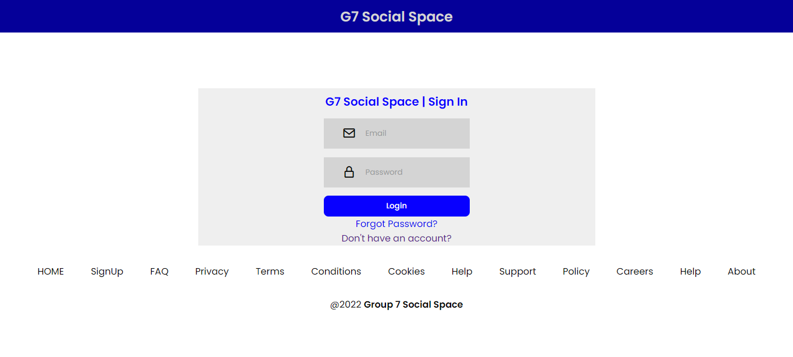

# G7 Social Space
> An online dynamic social platform project by Group 7 Design and Analysis of Algorithms. The social platform allows different people to interact with each other.

## Table of Contents
* [Features](#features)
* [Posts](#posts)
* [Search Functionality](#search-functionality)
* [Preview](#preview)
* [Built With](#built-with)
* [Software Required](#software-required)
* [Installation](#installation)

### Features
- Login and Signup
- Logout
- A user can view how many posts they have posted
- Newsfeed to view posts of other users
- Commenting on posts
- Deleting a post
- Messaging users
- Editing user details
- Adding and changing both profile and cover pictures
- Finding People in the database
- Forgot password

### Posts
#### Users can post 3 types of posts which are;
- text only posts
- image only posts and 
- a post having both image and text (a caption) to describe the image

### Search Functionality
#### Users can search for others users by;
- using the first name of the user
- using the last name or 
- by using the user’s username

### Preview

### Built With
#### Front end:
- HTML5
- CSS3
- Javascript

#### Back end:
- PHP
- MySQL

### Software Required
- XAMPP Control Panel
- XAMPP Server

### Installation
- Install XAMPP and inside the XAMPP folder in your C drive, open htdocs folder.

- In the htdocs folder, create a new file named “G7-FAcebook” and copy all the assets into that file. (A copy of the source code is also available in the GitHub account (https://github.com/brianmurutu)

- Once it’s complete, open XAMPP Control Panel and start both Apache and MySQL.

- Open a browser of your choice and type http://localhost/phpmyadmin/ to create a database named 
“g7_facebook”.

- Import database “g7_facebook.sql” inside the database folder.

- Once that is done, on a new tab type http://localhost/G7-Facbook/ to open the project and view its features.

### Contributors (Group Members)
- BRIAN  MURUTU - BIT/2021/83742
- ABDULMUTALIB  MURSHID - BIT/2021/41251
- HABIBA  DALO  OMAR - BIT/2021/85954
- GRACE  KAMAU - BIT/2021/85988
- ABDULMAHAT  ABDI - BIT/2021/73022
- CATHERINE  MUIA - BIT/2021/89194

